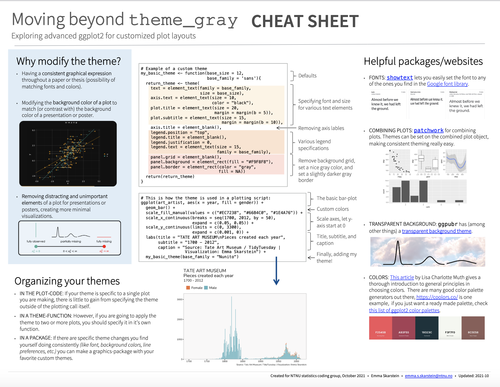
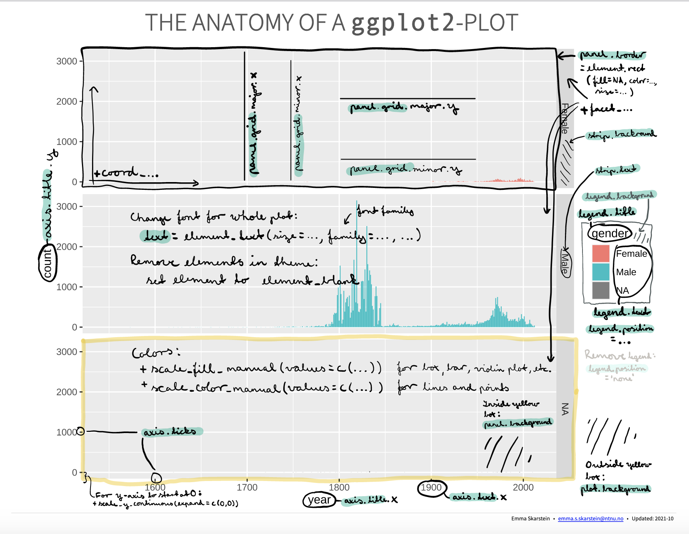
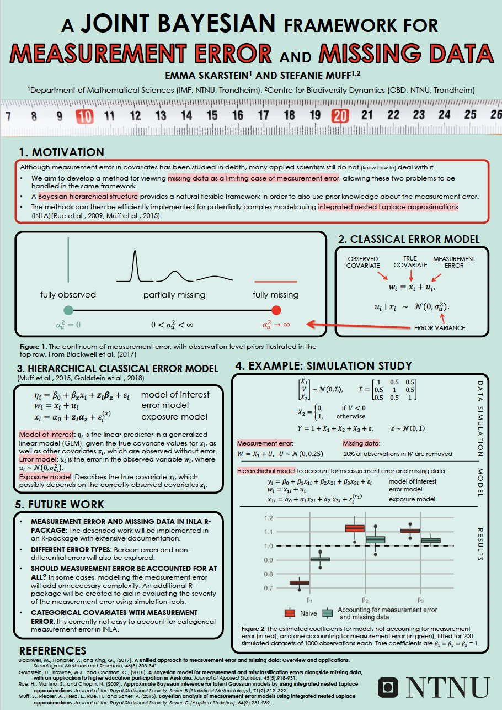
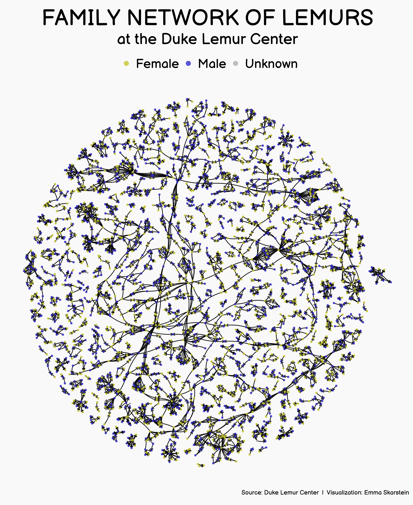

## BIO

I'm a PhD student of statistics at the Norwegian University of Science and Technology (NTNU). I'm currently working with Bayesian methods for measurement error correction, using integrated nested Laplace approximation (INLA). Apart from that, I also really enjoy data visualization, specifically I use R programming language and the ggplot2 package for this. In my free time, I garden and play with my incredible cat Hermione ([who is an aspiring celebrity on Instagram](https://www.instagram.com/tiny.hermione.the.cat/)).
 
 
---

## PORTFOLIO

*A wide selection of personal and professional work, including data visualizations, conference posters, presentation slides, and educational resources.*

#### My ggplot2 resources

::: {.floatting}

```{r echo = FALSE, out.width='25%', out.extra='style="float:right; padding:10px; border-radius:8%"'}

```

:::

**[CREATING CUSTOM THEMES IN GGPLOT2](https://emmaskarstein.github.io/images/cheatsheets_themes.pdf)** | A cheatsheet created based on a presentation held for the NTNU statistics group coding group: "Moving beyond theme_gray: Exploring customized themes for improved visualizations in ggplot2"

.  

.  


::: {.floatting}

```{r echo = FALSE, out.width='25%', out.extra='style="float:right; padding:10px; border-radius:8%"'}

```

:::

**[THE ANATOMY OF A GGPLOT2-PLOT](https://emmaskarstein.github.io/images/anatomy_of_ggplot.pdf)** | My reference for remembering all the different theme-variables in ggplot2.

.  

.  

#### Posters

::: {.floatting}

```{r echo = FALSE, out.width='25%', out.extra='style="float:right; padding:10px; border-radius:8%"'}

```

:::


**[A JOINT BAYESIAN FRAMEWORK FOR MEASUREMENT ERROR AND MISSING DATA](https://emmaskarstein.github.io/images/Poster_Nordstat.pdf)** | Poster presentation from Nordstat 2021 conference, "The 28th Nordic Conference in Mathematical Statistics", presenting my work on jointly modelling measurement error and missing data using INLA. 

.

.

.

#### TidyTuesday contributions

::: {.floatting}

```{r echo = FALSE, out.width='25%', out.extra='style="float:right; padding:10px; border-radius:8%"'}

```

:::

**[TidyTuesday data visualizations](https://github.com/emmaSkarstein/tidytuesday)** | Every Tuesday, the Tidy Tuesday project publishes a dataset for people to practice their data cleaning and data visualization. This GitHub repository contains my contributions!
