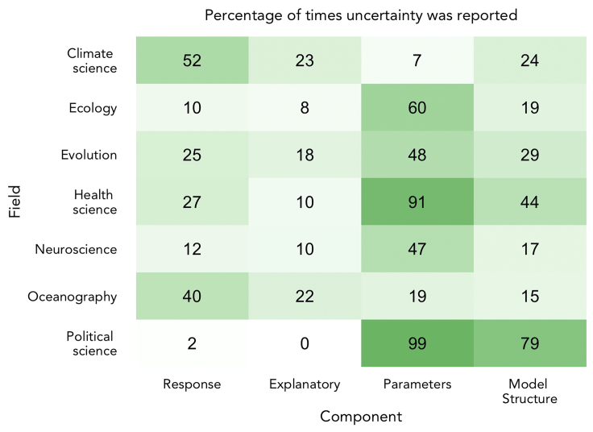
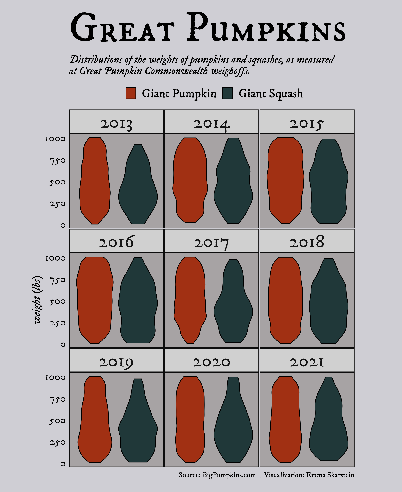

## BIO

I'm a PhD student of statistics at the Norwegian University of Science and Technology (NTNU). I'm currently working with Bayesian methods for measurement error correction, using integrated nested Laplace approximation (INLA). Apart from that, I also really enjoy data visualization, specifically I use R programming language and the ggplot2 package for this.
 
 
---

## PORTFOLIO

*A selection of personal and professional work, including data visualizations, conference posters, presentation slides, and educational resources.*


#### Research

::: {.floatting}

```{r echo = FALSE, out.width='25%', out.extra='style="float:right; padding:10px; border-radius:8%"'}

```

:::


**[inlami](https://emmaskarstein.github.io/inlami/)** | An R-package for fitting measurement error and missing data imputation models using INLA. 

.

.

.

.

::: {.floatting}

```{r echo = FALSE, out.width='25%', out.extra='style="float:right; padding:10px; border-radius:8%"'}
knitr::include_graphics("images/simulation_boxplot.png")
```

:::


**[A joint Bayesian framework for missing data and measurement error using integrated nested Laplace approximations](https://onlinelibrary.wiley.com/doi/full/10.1002/bimj.202300078)** | How a measurement error model can be used to do missing data imputation in INLA. The first paper of my PhD.

.

.


::: {.floatting}

```{r echo = FALSE, out.width='25%', out.extra='style="float:right; padding:10px; border-radius:8%"'}

```

:::


**[INSIGHTS INTO THE QUANTIFICATION AND REPORTING OF MODEL-RELATED UNCERTAINTY ACROSS DIFFERENT DISCIPLINES](https://pubmed.ncbi.nlm.nih.gov/36465136/)** | A cross-disciplinary review project, examining how different fields report uncertainty. 

.

.

.


::: {.floatting}

```{r echo = FALSE, out.width='25%', out.extra='style="float:right; padding:10px; border-radius:8%"'}
knitr::include_graphics("images/Poster_ISBA.png")
```

:::


**[WE SHOW HOW TO HANDLE MISSING DATA IN INLA BY GENERALIZING EXISTING MEASUREMENT ERROR MODELS](https://emmaskarstein.github.io/images/Poster_ISBA.png)** | Poster presentation from ISBA 2022 World meeting, presenting a method for covariate imputation in INLA using measurement error models. The poster received a prize.

.

.

.

.

::: {.floatting}

```{r echo = FALSE, out.width='25%', out.extra='style="float:right; padding:10px; border-radius:8%"'}

```

:::


**[A JOINT BAYESIAN FRAMEWORK FOR MEASUREMENT ERROR AND MISSING DATA](https://emmaskarstein.github.io/images/Poster_Nordstat.pdf)** | Poster presentation from Nordstat 2021 conference, "The 28th Nordic Conference in Mathematical Statistics", presenting my work on jointly modelling measurement error and missing data using INLA. 

.

.

.


#### Data graphics and visualization resources

::: {.floatting}

```{r echo = FALSE, out.width='25%', out.extra='style="float:right; padding:10px; border-radius:8%"'}

```

:::

**[TIDY TUESDAY DATA VISUALIZATIONS](https://github.com/emmaSkarstein/tidytuesday)** | Every Tuesday, the Tidy Tuesday project publishes a dataset for people to practice their data cleaning and data visualization. This GitHub repository contains all my contributions!

.

.

.

::: {.floatting}

```{r echo = FALSE, out.width='25%', out.extra='style="float:right; padding:10px; border-radius:8%"'}
knitr::include_graphics("images/british_monarchs.png")
```

:::

**[VISUALIZATION PROJECTS](https://github.com/emmaSkarstein/visualization_projects)** | Slightly bigger visualization projects centered around data I am interested in.

.

.

.

.

.

::: {.floatting}

```{r echo = FALSE, out.width='25%', out.extra='style="float:right; padding:10px; border-radius:8%"'}

```

:::

**[CREATING CUSTOM THEMES IN GGPLOT2](https://emmaskarstein.github.io/images/cheatsheets_themes.pdf)** | A cheatsheet created based on a presentation held for the NTNU statistics group coding group: "Moving beyond theme_gray: Exploring customized themes for improved visualizations in ggplot2"

.  

.  


::: {.floatting}

```{r echo = FALSE, out.width='25%', out.extra='style="float:right; padding:10px; border-radius:8%"'}
knitr::include_graphics("images/small_anatomy.png")
```

:::

**[THE ANATOMY OF A GGPLOT2-PLOT](https://emmaskarstein.github.io/images/anatomy_of_ggplot.pdf)** | My reference for remembering all the different theme-variables in ggplot2.


.  

.  

